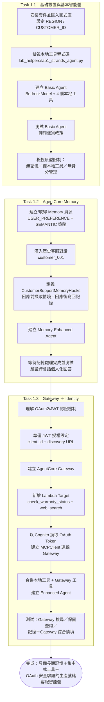

# notebook.ipynb 逐步解析

本篇針對 `notebook.ipynb`（Lab 1）的 34 個 cell 做完整拆解，依執行順序整理成 18 個步驟，分屬三大任務（Task 1.1 / 1.2 / 1.3）。每個步驟先給一句話的「目的」，再展開「詳細說明」；最後附上整體流程圖。`notebook_zh_cn.ipynb` 為同一份筆記本的簡體中文翻譯版，程式碼與步驟完全一致，以下說明兩份筆記本皆適用。

## 總覽

這份筆記本用「持續增強同一個智能體」的方式，示範一個客服智能體如何從「本地原型」演進為「生產就緒的企業級智能體」：

1. **Task 1.1**：用 Strands Agents + 本地工具建立最基本的客服智能體
2. **Task 1.2**：加入 Amazon Bedrock AgentCore Memory，讓智能體具備跨會話的長期記憶
3. **Task 1.3**：加入 AgentCore Gateway + Identity，把工具集中化管理並用 OAuth2/JWT 做安全存取控制

每個任務都是在前一個任務建立的智能體基礎上「疊加能力」，而非重新打造，這也是整份筆記本的設計主軸。

---

## Task 1.1　基礎設置與基本智能體建立

### 步驟 1：環境準備與函式庫載入（Cell 0–2）

**目的**：安裝依賴、匯入所有後續會用到的 AWS SDK、AgentCore 與 Strands 相關套件，並設定基本參數。

**詳細說明**：
Cell 0 的 Markdown 說明本任務要建立的架構——一個在本機執行、只使用本地工具的簡單智能體原型（對應 `images/architecture_lab1_strands.png` 示意圖）。Cell 2 的程式碼匯入：
- `boto3`、`requests`、`uuid`、`time` 等基礎套件
- AgentCore 的 `MemoryClient`、`StrategyType`（此時先匯入，供 Task 1.2 使用）
- Strands 的 `Agent`、`BedrockModel`、`MCPClient`、hook 相關類別（`HookProvider`、`HookRegistry`、`MessageAddedEvent`、`AfterInvocationEvent`）
- 從 `lab_helpers.lab1_strands_agent` 匯入四個本地工具函式與 `SYSTEM_PROMPT`、`MODEL_ID`
- 從 `lab_helpers.utils` 與 `scripts.utils` 匯入操作 SSM 參數的輔助函式

同時設定 `REGION = "us-east-1"`、`CUSTOMER_ID = "customer_001"`（後續模擬的固定客戶）與隨機產生的 `SESSION_ID`。這一步只是準備工作，沒有呼叫任何 AWS 服務。

### 步驟 2：檢視本地工具程式碼（Cell 3）

**目的**：在寫程式呼叫智能體之前，先理解智能體「能做什麼」——也就是 `lab_helpers/lab1_strands_agent.py` 裡定義的四個工具。

**詳細說明**：
這是一個純閱讀步驟（無程式碼），要求開發者打開 `lab1_strands_agent.py` 檢視：
- 工具是用 Strands 的 `@tool` 裝飾器定義的一般 Python 函式
- 四個工具：`get_product_info()`（產品規格）、`get_return_policy()`（退換貨政策）、`get_technical_support()`（技術支援，會查詢 Bedrock Knowledge Base）、`web_search()`（用 `ddgs` 做網路搜尋）
- 前兩個工具目前用寫死在程式中的字典模擬資料庫；`get_technical_support()` 則是真的會呼叫 AWS 服務（從 SSM 取得 Knowledge Base ID 再用 Strands 的 `retrieve` 工具做 RAG 檢索）
- `SYSTEM_PROMPT` 定義了智能體的人設：一位電子產品電商的專業客服，並列出可用工具與使用原則

### 步驟 3：建立基礎智能體 Basic Agent（Cell 4–5）

**目的**：組裝出第一個可運作的客服智能體——模型 + 系統提示 + 本地工具。

**詳細說明**：
Cell 4 的 Markdown 說明一個 Agent 的三個核心組成（Foundation Model、System Prompt、Specialized Tools），以及智能體收到問題後的內部流程：分析問題 → 選擇工具 → 執行工具 → 整合回應 → 品質檢查。Cell 5 對應的程式碼：
```python
model = BedrockModel(model_id=MODEL_ID, temperature=0.3, region_name=REGION)
basic_agent = Agent(
    model=model,
    tools=[get_product_info, get_return_policy, get_technical_support, web_search],
    system_prompt=SYSTEM_PROMPT
)
```
`MODEL_ID` 為 `us.amazon.nova-pro-v1:0`（Amazon Nova Pro），`temperature=0.3` 讓回答偏向穩定、少發散。這一步完全在本機執行，沒有建立任何 AgentCore 雲端資源。

### 步驟 4：測試基礎智能體（Cell 6–7）

**目的**：驗證智能體能理解問題並正確呼叫工具產生答案。

**詳細說明**：
Cell 7 呼叫 `basic_agent("What's the return policy for laptops?")`。智能體會自主判斷應呼叫 `get_return_policy(product_category="laptops")`，取得政策內容後生成友善、格式化的回覆。此測試驗證了「模型推理 + 工具呼叫 + 回應整合」這條最基本的 Agent 迴路已經跑通。

### 步驟 5：檢視原型限制（Cell 8）

**目的**：點出目前這個智能體的三個關鍵缺陷，作為進入 Task 1.2 / 1.3 的動機。

**詳細說明**：
- **無持久記憶**：智能體只記得目前這次對話，換一個 session 就完全失憶
- **僅本地工具**：工具程式碼寫死在單一檔案中，無法被其他智能體或系統共用
- **無身分管理**：無法代表特定使用者行動、也沒有存取控制機制

這三點分別對應 Task 1.2（Memory）與 Task 1.3（Gateway + Identity）要解決的問題。

---

## Task 1.2　以 AgentCore Memory 強化記憶

### 步驟 6：建立／取得 AgentCore Memory 資源（Cell 9–10）

**目的**：建立一個具備兩種記憶策略的 AgentCore Memory 資源，作為智能體的長期記憶儲存層。

**詳細說明**：
Cell 9 的 Markdown 用一個情境故事（客戶三週前聯繫過客服，這次得重複描述問題）說明長期記憶的必要性，並區分：
- **短期記憶（Short-Term Memory）**：單次對話內的上下文，由 Strands Agent 框架自動處理
- **長期記憶（Long-Term Memory）**：跨多次對話萃取出的事實、偏好與摘要，由 AgentCore Memory 服務負責

Cell 10 的 `create_or_get_memory_resource()` 函式會先嘗試從 SSM 讀取既有的 `memory_id`（避免重複建立），若不存在則呼叫 `memory_client.create_memory_and_wait()` 建立新的 Memory 資源，設定兩種策略：

| 策略 | 用途 | Namespace |
|---|---|---|
| `USER_PREFERENCE` | 擷取客戶偏好與行為 | `support/customer/{actorId}/preferences` |
| `SEMANTIC` | 儲存對話中的事實資訊 | `support/customer/{actorId}/semantic` |

建立完成後把 `memory_id` 寫回 SSM 參數 `/app/customersupport/agentcore/memory_id`，供之後（或其他腳本）重複使用。`event_expiry_days=90` 代表原始對話事件 90 天後會過期（但萃取出的長期記憶不受此限制）。

### 步驟 7：灌入歷史客服互動紀錄（Cell 11–12）

**目的**：模擬一位「老客戶」過去的對話紀錄，讓 AgentCore Memory 有素材可以萃取出長期洞察。

**詳細說明**：
Cell 12 準備了三段虛構的歷史對話（MacBook Pro 過熱問題、遊戲耳機退貨政策、想買 1200 美元以下的程式設計筆電且偏好 ThinkPad），以 `(text, role)` tuple 的形式組成 `previous_interactions`，透過 `memory_client.create_event(memory_id, actor_id="customer_001", session_id="previous_session", messages=previous_interactions)` 寫入 Memory。寫入後 AgentCore Memory 會在背景非同步地依先前設定的兩種策略，把這些原始對話萃取成結構化的長期記憶（例如「偏好 ThinkPad」「重視 Linux 相容性」），這個處理需要一些時間，因此後面步驟會有等待動作。

### 步驟 8：定義記憶 Hook（Cell 13–14）

**目的**：讓「讀取客戶情境」與「寫回新對話」這兩個記憶操作自動發生，不需要每次手動呼叫 Memory API。

**詳細說明**：
Cell 14 定義 `CustomerSupportMemoryHooks(HookProvider)` 類別，實作 Strands 的 Hook 系統，掛上兩個回呼：
- `retrieve_customer_context()` 掛在 `MessageAddedEvent`：每當使用者送出新訊息，就依 `USER_PREFERENCE` 與 `SEMANTIC` 兩個 namespace 各查詢最相關的 3 筆記憶（`top_k=3`），並把查到的內容以 `"Customer Context:\n..."` 的形式插入使用者訊息前方，讓模型在生成回覆前就能看到這些背景資訊
- `save_support_interaction()` 掛在 `AfterInvocationEvent`：每當智能體完成一次回覆，就從對話紀錄中找出最新一組「使用者提問／智能體回覆」，呼叫 `create_event()` 寫回 Memory，讓這次互動也成為未來查詢的素材

`register_hooks()` 把這兩個方法註冊進 `HookRegistry`。整個機制讓記憶的讀取與寫入完全對智能體使用者透明。

### 步驟 9：建立記憶增強智能體（Cell 15–16）

**目的**：把記憶 Hook 接上智能體，得到一個「有記憶」的客服智能體。

**詳細說明**：
```python
memory_hooks = CustomerSupportMemoryHooks(memory_id, memory_client, CUSTOMER_ID, SESSION_ID)
memory_agent = Agent(
    model=model,
    tools=[get_product_info, get_return_policy, get_technical_support, web_search],
    hooks=[memory_hooks],
    system_prompt=SYSTEM_PROMPT
)
```
與步驟 3 的 `basic_agent` 相比，工具與系統提示完全相同，唯一差異是多帶了 `hooks=[memory_hooks]`——這正是這個 Lab 想凸顯的設計理念：記憶能力是「疊加」上去的，不需要重寫智能體本身的邏輯。

### 步驟 10：測試記憶增強智能體（Cell 17）

**目的**：驗證智能體能「想起」步驟 7 灌入的歷史偏好，而不需要客戶重新描述。

**詳細說明**：
由於步驟 7 寫入的記憶需要背景非同步處理，Cell 17 先 `time.sleep(90)` 等待 90 秒，確保 AgentCore Memory 已完成萃取，接着呼叫 `memory_agent("What are my laptop preferences?")`。此時 `retrieve_customer_context` hook 會自動查到「偏好 ThinkPad、需要 16GB RAM、重視 Linux 相容性」等先前萃取出的偏好並注入提問，智能體因此能給出個人化回答，而不是要求客戶重新說明需求——這正對應 Cell 9 開頭情境故事想解決的問題。

---

## Task 1.3　以 Gateway 與 Identity 擴展工具規模

### 步驟 11：理解 Gateway 與 OAuth2/JWT 認證機制（Cell 18–19）

**目的**：在動手建立 Gateway 之前，先說明「為什麼需要 Gateway」以及它的安全機制如何運作。

**詳細說明**：
Cell 18 說明企業場景中工具管理的痛點——當工具/API 數量成長到數百個時，各自散落在不同智能體程式碼中難以維護與治理。AgentCore Gateway 提供一個統一的 **MCP（Model Context Protocol）** 端點，讓既有的 Lambda 函式、企業 API 可以被安全地暴露成工具，並支援語意化的工具探索。同時說明 **AgentCore Identity** 在此扮演入站身分驗證（inbound auth，與 Cognito 協作）的角色，出站驗證（outbound auth，存取第三方服務）雖然存在但本 Lab 不使用。

Cell 19 用一段文字流程圖說明 OAuth2 client-credentials 的四方互動：智能體用 `client_id` / `client_secret` 向 Cognito 換取 JWT token → 智能體帶著 token 呼叫 Gateway → Gateway 向 Cognito 驗證 token 是否合法且來自允許的 client → 驗證通過後才放行。所有憑證都已由 CloudFormation 事先建立並存放於 SSM，程式中不會出現任何硬編碼密鑰。

### 步驟 12：準備 JWT 授權設定（Cell 20）

**目的**：從 SSM 取出 Cognito 的 `client_id` 與 discovery URL，組成 Gateway 要求的授權設定物件。

**詳細說明**：
```python
machine_client_id = get_ssm_parameter("/app/customersupport/agentcore/machine_client_id")
cognito_discovery_url = get_ssm_parameter("/app/customersupport/agentcore/cognito_discovery_url")
auth_config = {
    "customJWTAuthorizer": {
        "allowedClients": [machine_client_id],
        "discoveryUrl": cognito_discovery_url
    }
}
```
`allowedClients` 是一份白名單，只有這個 client_id 簽發的 token 能通過 Gateway 驗證；`discoveryUrl` 讓 Gateway 能動態取得 Cognito 的 OAuth metadata（token 端點、支援的 scope 等），不需要手動填寫每一項端點資訊。

### 步驟 13：建立 AgentCore Gateway（Cell 21–22）

**目的**：建立實際的 Gateway 資源，做為智能體與後端 Lambda 之間的安全代理層。

**詳細說明**：
Cell 21 說明接下來三步：建立 Gateway → 掛上 Lambda target（工具定義）→ 智能體連線 Gateway。並強調 CloudFormation 只部署了「一支」Lambda 函式（`CustomerSupportLambda`）就能處理多個工具操作，比每個工具各自部署一支函式更精簡。

Cell 22 呼叫 `gateway_client.create_gateway()`，指定：
- `roleArn`：從 SSM 取得的 IAM 執行角色
- `protocolType="MCP"`：使用 Model Context Protocol
- `authorizerType="CUSTOM_JWT"` 搭配步驟 12 的 `auth_config`

建立後輪詢 `get_gateway()` 直到狀態變成 `READY`（或 `FAILED` 時拋出自訂例外 `CreationFailedError`），並把 `gateway_id` 寫回 SSM。程式碼也處理了 `ConflictException`（Gateway 已存在時直接讀取既有資源），讓這個 cell 可以重複執行而不出錯。

### 步驟 14：新增 Lambda Target（Cell 23–24）

**目的**：告訴 Gateway「這支 Lambda 提供哪些工具、每個工具的參數長什麼樣子」，讓智能體可以透過 MCP 發現並呼叫它們。

**詳細說明**：
Cell 24 定義 `api_spec`，以 JSON Schema 描述兩個工具：
- `check_warranty_status`：需要 `serial_number`（必填）與 `customer_email`
- `web_search`：需要 `keywords`（必填），可選 `region`、`max_results`

這與步驟 2 中本地 `web_search()` 工具的功能相同，但這裡改為透過 Gateway／Lambda 提供——示範同一種能力如何從「本地工具」遷移為「集中式工具」。接著組成 `lambda_target_config`（帶入 Lambda ARN 與這份 schema），呼叫 `gateway_client.create_gateway_target()` 把它掛載到步驟 13 建立的 Gateway 上，`credentialProviderConfigurations` 指定用 `GATEWAY_IAM_ROLE` 讓 Gateway 以自己的角色權限呼叫 Lambda。

### 步驟 15：建立具備 OAuth 認證的 MCP Client（Cell 25–26）

**目的**：讓智能體能以合法的 JWT token 連上 Gateway，取得可呼叫的工具清單。

**詳細說明**：
Cell 26 先定義 `get_cognito_client_secret()`（呼叫 Cognito API 取得 client secret）與 `get_oauth_token()`（以 `grant_type=client_credentials` 的 OAuth2 流程，帶著 `client_id`／`client_secret`／`scope` 向 Cognito 的 token 端點換取 access token）。拿到 JWT 格式的 `access_token` 後：
```python
mcp_client = MCPClient(
    lambda: streamablehttp_client(
        gateway_url,
        headers={"Authorization": f"Bearer {access_token}"},
    )
)
```
用 Strands 的 `MCPClient` 包裝一個會帶上 `Authorization: Bearer <token>` 標頭的 HTTP 串流連線，這正是步驟 11 說明的 OAuth 流程在程式碼中的具體實作。

### 步驟 16：合併本地工具與 Gateway 工具，建立 Enhanced Agent（Cell 27–28）

**目的**：把「記憶 Hook + 本地工具 + Gateway 工具」三者合而為一，組成本 Lab 最終、也是能力最完整的智能體。

**詳細說明**：
Cell 28 先呼叫 `mcp_client.start()` 建立連線，再用 `mcp_client.list_tools_sync()` 向 Gateway 查詢目前掛載的工具（此時會拿到 `web_search` 與 `check_warranty_status` 兩個 Gateway 工具）。接著組合：
```python
all_tools = [get_product_info, get_return_policy, get_technical_support] + gateway_tools
enhanced_agent = Agent(
    model=model,
    tools=all_tools,
    hooks=[memory_hooks],
    system_prompt=SYSTEM_PROMPT
)
```
留意這裡刻意拿掉了本地的 `web_search`（因為同名能力已經由 Gateway 提供），形成「部分工具留在本地（速度快、邏輯簡單）、部分工具集中在 Gateway（可重用、企業級整合）」的混合式架構，同時仍保有 Task 1.2 建立的記憶 Hook。這是整份筆記本三個任務成果的最終匯合點。

### 步驟 17：測試 Enhanced Agent（Cell 29–32）

**目的**：驗證合併後的智能體能同時正確使用本地工具、Gateway 工具，並保有客戶記憶。

**詳細說明**：三個測試情境依序驗證不同面向：
- Cell 30：`"Search for latest iPhone 15 troubleshooting tips"` → 驗證 Gateway 上的 `web_search` 工具可被正確呼叫
- Cell 31：`"Check warranty status for serial number ABC12345678"` → 驗證 Gateway 上代理既有企業 Lambda 的 `check_warranty_status` 工具
- Cell 32：`"I need gaming headphones again, and also search for the latest reviews"` → 同時觸發記憶（客戶先前問過遊戲耳機退貨政策）與 Gateway 搜尋工具，驗證記憶與集中式工具能協同運作

### 步驟 18：總結與後續（Cell 33）

**目的**：收尾並指引下一步。

**詳細說明**：
確認學習者已完成：建立基本智能體 → 加上 AgentCore Memory → 整合 AgentCore Gateway → 測試完整系統。提示接下來應關閉筆記本、回到 Lab 操作手冊，進入 Task 2，到 AgentCore 主控台實際檢視剛才建立的各項雲端資源（Memory、Gateway、Runtime 等）。

---

## 整體流程圖



流程圖清楚呈現三個任務「依序疊加能力」的設計：Task 1.1 的 Basic Agent 是後續一切的基礎；Task 1.2 只多加了 `hooks=[memory_hooks]` 就讓智能體具備長期記憶；Task 1.3 則是把部分工具從本地搬到 Gateway、並加上 OAuth2/JWT 驗證，最終在 Enhanced Agent 中把記憶與集中式工具整合在一起。
